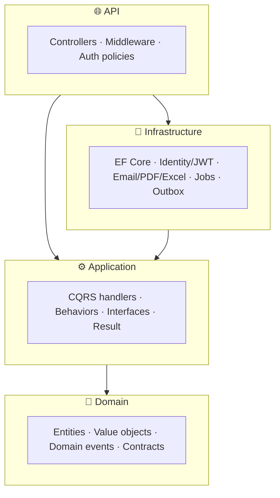
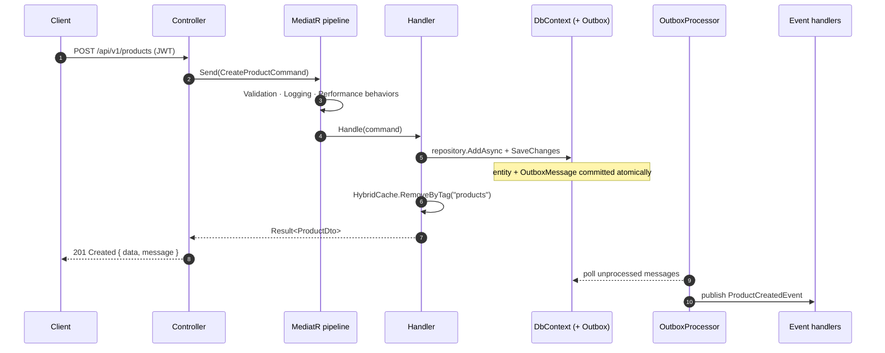

# CleanApi


A production-shaped **ASP.NET Core 10 Web API** built with Clean Architecture, Domain-Driven Design, and CQRS. Every cross-cutting concern is wired up, guarded so the app boots with **zero external infrastructure**, and demonstrated end-to-end by a working `Products` module.

---

## Table of contents

- [Features](#features)
- [Architecture](#architecture)
- [Request lifecycle](#request-lifecycle)
- [Quick start](#quick-start)
- [Project structure](#project-structure)
- [The Products module](#the-products-module--the-pattern-to-copy)
- [API endpoints](#api-endpoints)
- [Documentation](#documentation)
- [Configuration & secrets](#configuration--secrets)
- [Testing](#testing)
- [Docker](#docker)
- [Library & licensing notes](#library--licensing-notes)
- [License](#license)

---

## Features

| Area | What you get |
| --- | --- |
| **Architecture** | Clean Architecture + DDD (entities, value objects, domain events), enforced by architecture tests |
| **CQRS** | MediatR with validation, logging, performance, unhandled-exception, and caching pipeline behaviors |
| **Data** | EF Core 10 / SQL Server, entity configs, **DB views** (keyless), **stored procedures**, owned value objects, soft-delete, auditing, execution-strategy transactions |
| **Reliability** | **Transactional outbox** for at-least-once domain-event delivery |
| **Persistence style** | Repository + Specification (Ardalis) *and* an `IApplicationDbContext` unit of work |
| **AuthN / AuthZ** | ASP.NET Identity + JWT, **permission-based** policies, **account lockout**, **refresh-token rotation with reuse detection** |
| **API surface** | Result pattern → RFC 7807 ProblemDetails, API versioning, paging/sorting, **idempotency keys** |
| **Security** | Security-headers middleware, HSTS, CORS, rate limiting |
| **Observability** | Serilog (console/file/Seq), **OpenTelemetry** (traces + metrics, OTLP), Sentry, health checks |
| **Docs UI** | OpenAPI + Scalar with JWT auth built in |
| **Caching / jobs** | HybridCache (memory + optional Redis L2) with write-through invalidation; Hangfire + a `Channel`-based background service |
| **Documents / messaging** | MailKit email, QuestPDF, ClosedXML (Excel), Firebase push — all behind interfaces |
| **Delivery** | Docker (chiseled, non-root, `HEALTHCHECK`) + `docker compose` (app + SQL + Redis + Seq), GitHub Actions CI |
| **Quality** | xUnit unit + architecture + integration tests (Testcontainers), `.editorconfig`, warnings-as-errors, Central Package Management |

> Optional subsystems (Firebase, Sentry, OpenTelemetry) can be excluded at generation time — see [TEMPLATE.md](TEMPLATE.md).

## Architecture

Dependencies point **inwards**. `Domain` is the core and depends on nothing; the outer layers depend on the inner ones. `Infrastructure` implements interfaces declared in `Application`/`Domain` (dependency inversion).



| Layer | Responsibility | Depends on |
| --- | --- | --- |
| `CleanApi.Domain` | Entities, value objects, domain events, repository & auth contracts | — |
| `CleanApi.Application` | CQRS modules, pipeline behaviors, `Result`, paging, service interfaces | Domain |
| `CleanApi.Infrastructure` | EF Core, migrations, Identity/JWT, email/PDF/Excel/Firebase, jobs, outbox, seeders | Application |
| `CleanApi.Api` | Program, controllers, DI, exception handlers, authorization, OpenAPI | Application, Infrastructure |

These rules are **verified at build time** by `CleanApi.ArchitectureTests`, so the layering cannot silently rot. See [docs/architecture.md](docs/architecture.md) for the full deep dive.

## Request lifecycle

A write request flows through the MediatR pipeline; domain events are persisted to the outbox in the same transaction and published asynchronously.



## Quick start

### Option A — run everything in Docker

```bash
docker compose up --build
```

Starts SQL Server, Redis, Seq, **and the API** (which migrates + seeds on startup). API on `http://localhost:8080`.

### Option B — run the API locally against containerized infrastructure

```bash
docker compose up -d sqlserver redis seq
dotnet ef database update -p src/CleanApi.Infrastructure -s src/CleanApi.Api
dotnet run --project src/CleanApi.Api
```

> No Docker? Point `ConnectionStrings:Default` at any SQL Server (or SQL LocalDB). In **Development**, migrations + seeding run automatically on startup.

Then open:

| Endpoint | URL (local) |
| --- | --- |
| 📖 API docs (Scalar) | `http://localhost:5083/scalar` |
| ❤️ Health | `http://localhost:5083/health` |
| ⏱️ Hangfire dashboard | `http://localhost:5083/hangfire` |
| 📊 Seq logs (compose) | `http://localhost:8081` |

**Seeded administrator** (first run): `admin@example.com` / `Admin123!$`. Call `POST /api/v1/auth/login`, then send `Authorization: Bearer <token>` (or click **Authorize** in Scalar).

## Project structure

```
src/
  CleanApi.Domain          Entities, value objects, domain events, repository & auth contracts
  CleanApi.Application     CQRS modules, pipeline behaviors, Result, paging, service interfaces
  CleanApi.Infrastructure  EF Core, migrations, Identity/JWT, email/pdf/excel/firebase, jobs, outbox, seeders
  CleanApi.Api             Program, controllers, DI, exception handlers, authorization, OpenAPI
tests/
  CleanApi.Domain.UnitTests
  CleanApi.Application.UnitTests
  CleanApi.ArchitectureTests      layering rules (NetArchTest)
  CleanApi.Api.IntegrationTests   WebApplicationFactory + Testcontainers
```

## The `Products` module — the pattern to copy

Everything needed to add a feature is demonstrated under `src/CleanApi.Application/Modules/Products`:

- **Commands**: create, update, delete (soft), adjust-stock (transaction example).
- **Queries**: get-by-id, paged + cacheable list, category **summary (DB view)**, low-stock (**stored procedure**), Excel export, PDF export.
- One file per feature holds the request record, its FluentValidation validator, and its handler.
- Mapping is source-generated with **Mapperly**.

Step-by-step guide: [docs/adding-a-feature.md](docs/adding-a-feature.md).

## API endpoints

| Method | Route | Auth | Notes |
| --- | --- | --- | --- |
| `POST` | `/api/v1/auth/register` | anonymous | rate-limited |
| `POST` | `/api/v1/auth/login` | anonymous | returns access + refresh tokens; lockout after 5 fails |
| `POST` | `/api/v1/auth/refresh` | anonymous | rotates tokens; reuse detection |
| `GET` | `/api/v1/products` | `Products.Read` | paged, filterable, cached |
| `GET` | `/api/v1/products/{id}` | `Products.Read` | |
| `GET` | `/api/v1/products/summary` | `Products.Read` | reads a **DB view** |
| `GET` | `/api/v1/products/low-stock` | `Products.Read` | calls a **stored procedure** |
| `POST` | `/api/v1/products` | `Products.Create` | supports `Idempotency-Key` |
| `PUT` | `/api/v1/products/{id}` | `Products.Update` | |
| `POST` | `/api/v1/products/{id}/stock-adjustments` | `Products.Update` | transactional |
| `DELETE` | `/api/v1/products/{id}` | `Products.Delete` | soft delete |
| `GET` | `/api/v1/products/export/excel` | `Products.Export` | ClosedXML |
| `GET` | `/api/v1/products/export/pdf` | `Products.Export` | QuestPDF |
| `POST` | `/api/v1/admin/notifications/push` | `Admin.SendNotifications` | Firebase (no-op if unconfigured) |
| `POST` | `/api/v1/admin/jobs/*` | `Admin.ManageUsers` | Hangfire + in-process queue demos |

## Documentation

| Guide | Contents |
| --- | --- |
| [docs/architecture.md](docs/architecture.md) | Layers, dependency rules, CQRS pipeline, Result pattern, outbox, domain events |
| [docs/adding-a-feature.md](docs/adding-a-feature.md) | Add a new command/query/module step by step |
| [docs/configuration.md](docs/configuration.md) | Every config key, environment variables, secrets, profiles |
| [docs/security.md](docs/security.md) | Auth flow, permissions, refresh rotation, lockout, headers, idempotency |
| [TEMPLATE.md](TEMPLATE.md) | Using the `dotnet new` template + feature toggles |

## Configuration & secrets

External integrations are **off by default** and only activate when configured:

| Integration | Enabled when… | Otherwise |
| --- | --- | --- |
| Redis (HybridCache L2) | `ConnectionStrings:Redis` set | in-memory L1 only |
| Hangfire SQL storage | `Hangfire:UseSqlServerStorage` = `true` | in-memory storage |
| Sentry | `Sentry:Dsn` set | disabled |
| OpenTelemetry export | `OpenTelemetry:OtlpEndpoint` set | traced in-process, not exported |
| Firebase push | `Firebase:ServiceAccountPath` set | no-op |

**Never commit secrets.** A throwaway `Jwt:SigningKey` lives in `appsettings.Development.json` so a fresh clone runs immediately; for any real environment supply it via user-secrets or environment variables:

```bash
dotnet user-secrets set "Jwt:SigningKey" "<a strong 32+ char key>" --project src/CleanApi.Api
```

Full reference: [docs/configuration.md](docs/configuration.md).

## Testing

```bash
dotnet test
```

Unit and architecture tests run everywhere. Integration tests spin up a real SQL Server via **Testcontainers**; if Docker isn't available they skip themselves so the suite stays green.

## Docker

```bash
docker build -t cleanapi .
docker run -p 8080:8080 -e ConnectionStrings__Default="<connection string>" cleanapi
```

Runtime image is the chiseled (distroless) ASP.NET base, runs as a non-root user, and ships a `HEALTHCHECK`.

## Library & licensing notes

This template favors permissively-licensed libraries:

- **MediatR is pinned to `12.5.0`** — the last Apache-2.0 release (13+ is commercial). Do not bump without a license review.
- **QuestPDF** runs under its free **Community** license (set in `Program.cs`).
- **ClosedXML (MIT)** is used for Excel instead of EPPlus (commercial for commercial use).
- Tests use **NSubstitute** and **AwesomeAssertions**; mapping uses **Mapperly** — all free.

## License

This project's source is provided under the [MIT License](LICENSE). Third-party libraries retain their own licenses (see the note above).
