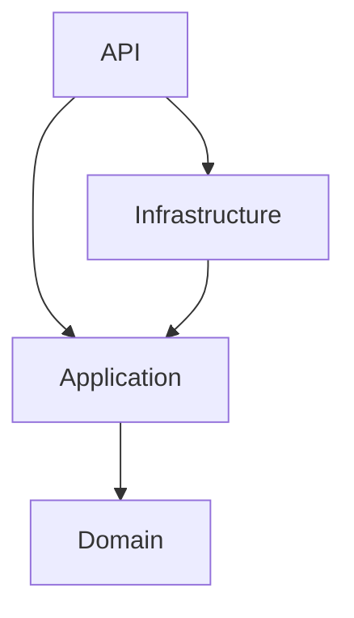
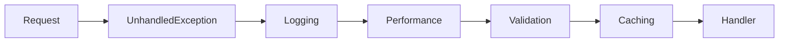
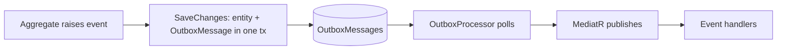

# Architecture

CleanApi follows Clean Architecture with a Domain-Driven core. This document explains the layers, the rules that keep them honest, and the key patterns.

## Layers & dependency rule



The dependency rule is simple: **source-code dependencies only point inwards.** The Domain knows nothing about the outside world; the Application defines the interfaces it needs; the Infrastructure implements them.

| Project | Contains | May reference |
| --- | --- | --- |
| `Domain` | Entities, value objects, domain events, `IRepository<T>`, authorization constants | nothing |
| `Application` | CQRS handlers, pipeline behaviors, `IApplicationDbContext`, service interfaces, `Result`, paging | Domain |
| `Infrastructure` | `AppDbContext`, EF configs, migrations, Identity/JWT, email/PDF/Excel/Firebase, jobs, outbox, seeders | Application |
| `Api` | Controllers, middleware, exception handlers, authorization handlers, DI composition, OpenAPI | Application, Infrastructure |

These are enforced by `CleanApi.ArchitectureTests` (NetArchTest): Domain cannot depend on other layers, Application cannot depend on Infrastructure or Api, and request handlers must be sealed. A violation fails the build.

## CQRS with MediatR

Every use case is a `Command` (write) or `Query` (read) implementing `IRequest<Result<T>>`, handled by an `IRequestHandler`. Requests pass through a pipeline of behaviors before reaching the handler:



- **UnhandledExceptionBehavior** — logs anything that escapes a handler.
- **LoggingBehavior** — structured entry per request, tagged with the current user.
- **PerformanceBehavior** — warns on slow requests.
- **ValidationBehavior** — runs FluentValidation validators; throws the Application `ValidationException` (mapped to 400) so handlers never validate input themselves.
- **CachingBehavior** — for queries implementing `ICacheableQuery`, served from HybridCache.

Handlers are thin: check invariants, act through the repository / `IApplicationDbContext`, return a `Result`.

## The Result pattern

Handlers return `Result` / `Result<T>` instead of throwing for *expected* failures (not found, conflict, forbidden, validation). A single translator — `ApiResultExtensions.ToActionResult()` — maps a `Result` to an HTTP response (RFC 7807 ProblemDetails on failure). Controllers are one-liners:

```csharp
public async Task<IActionResult> GetById(int id, CancellationToken ct)
    => (await Mediator.Send(new GetProductByIdQuery(id), ct)).ToActionResult();
```

Unexpected failures throw and are caught by the `IExceptionHandler` chain (`ValidationExceptionHandler` then `GlobalExceptionHandler`).

## Domain events & the transactional outbox

Aggregates raise domain events (`BaseEntity.RaiseDomainEvent`). On `SaveChangesAsync`, the DbContext serializes pending events into `OutboxMessages` **in the same transaction** as the state change. A background `OutboxProcessor` polls the table, publishes each event through MediatR, and marks it processed.



This guarantees **at-least-once** delivery even if the process crashes right after commit. Because delivery is at-least-once, event handlers should be idempotent. Domain events carry primitive data (not entity references) so they serialize cleanly.

## Data access: two complementary styles

- **Repository + Specification** (`IRepository<T>` / `IReadRepository<T>`, Ardalis.Specification) for aggregate reads/writes. Query logic lives in `Specification<T>` classes, keeping it testable and out of handlers.
- **`IApplicationDbContext`** (the DbContext as unit of work) for cross-entity existence checks and for querying keyless **views** and **stored procedures**, which don't fit the repository shape.

## Views & stored procedures

Keyless result types live in `Domain` and are mapped automatically by reflection:

- A **view** type implements `IReadOnlyView` and carries `[DbView("Vw_Name")]`.
- A **stored-procedure** result type implements `IReadOnlyStoredProc`.

The SQL is created in a migration via `CreateOrAlterView` / `CreateOrAlterStoredProcedure`. See `Vw_ProductSummary` and `usp_GetLowStockProducts` for worked examples.

## Cross-cutting persistence

`AppDbContext.SaveChangesAsync` applies, in order: audit stamping (`IAuditableEntity`), soft-delete conversion (`ISoftDeletable` deletes become updates hidden by a global query filter), and outbox writing — then saves once.
