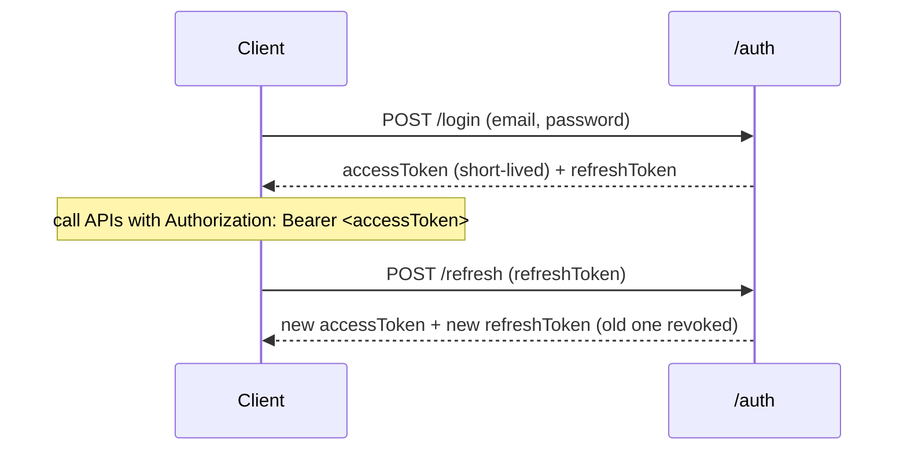

# Security

## Authentication

ASP.NET Core Identity issues **JWT access tokens** plus rotating **refresh tokens**.

- Access tokens are validated with `ClockSkew = Zero` and `MapInboundClaims = false`.
- The signing key comes from configuration (user-secrets/env outside Development).

### Refresh-token rotation & reuse detection

Every refresh **rotates** the token: the presented token is revoked and linked (`ReplacedByToken`) to a freshly issued one. If a token that has *already been rotated* is presented again, that's treated as theft — **all of the user's active refresh tokens are revoked** and the request is rejected. Expired/revoked tokens are purged by a daily cleanup job.

### Account lockout

Login uses `SignInManager.CheckPasswordSignInAsync(..., lockoutOnFailure: true)`. After **5** failed attempts the account is locked for **15 minutes**.

## Authorization

Authorization is **permission-based**, not just role-based:

- Permissions are `Resource.Action` strings in `Permissions` (e.g. `Products.Create`).
- Roles are granted sets of permissions (`RolePermissions`), seeded as role claims.
- On login, a user's effective permissions are embedded as `permission` claims in the JWT.
- Endpoints declare `[HasPermission(Permissions.Products.Create)]`; a custom `IAuthorizationPolicyProvider` materializes a policy per permission on demand, and `PermissionAuthorizationHandler` checks the claim.

This means you can add permissions and reassign them to roles without touching endpoint code beyond the attribute.

## Transport & headers

- **Security headers** (`SecurityHeadersMiddleware`): `X-Content-Type-Options: nosniff`, `X-Frame-Options: DENY`, `Referrer-Policy: no-referrer`, a locked-down `Content-Security-Policy`, and more. The docs/dashboard UIs (`/scalar`, `/hangfire`) are exempted so their assets load.
- **HSTS** is enabled outside Development.
- **CORS** uses a single named policy driven by `Cors:AllowedOrigins` (never `AllowAnyOrigin` + credentials together).

## Rate limiting

Built-in `AddRateLimiter`:

- **Global** sliding-window limiter partitioned per authenticated user or client IP (100/min).
- **`auth`** policy — a stricter fixed window (10/min) on the auth endpoints.
- Rejections return `429` with a `Retry-After` header and a ProblemDetails body.

## Idempotency

Send an `Idempotency-Key` header on create requests. The first request executes and its response is cached; retries with the same key **replay** the stored response instead of executing again (applied to `POST /products`). Backed by an in-memory cache — swap for a distributed cache in a multi-instance deployment.

## Error handling

Failures never leak internals. Expected failures flow through the `Result` pattern to ProblemDetails; unexpected exceptions are caught by the `IExceptionHandler` chain, logged, and returned as a generic 500 outside Development.

## Secrets

See [configuration.md](configuration.md#secrets). The short version: nothing sensitive is committed; Development uses a clearly-marked throwaway key, and every other environment supplies secrets via user-secrets or environment variables.
